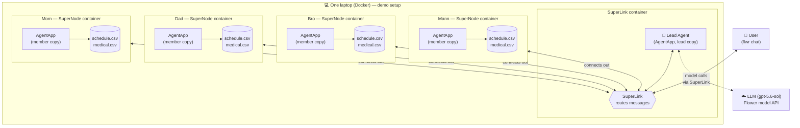

# family-hub

Directory Structure:
```
family-hub/
    ui/
    agentapp/
    deploy/
    .gitignore
    README.md
    PLAN.md
```

- agent/ needs its own pyproject.toml. Flower packages that folder as a unit. Keep the UI code out of it.
- ui/ has its own Node or Python setup, so the two do not mix.
- deploy/ holds the Docker setup. Each teammate runs it on their laptop.

```
family-hub/
  ui/              web app (runs outside Flower)
  agent/        AgentApp with its own pyproject.toml
    pyproject.toml
    family_hub/
      agent_app.py
      calendar_tool.py   calendar code, if it can live in the AgentApp
  deploy/
    compose.yaml         one SuperNode service for each laptop
  .gitignore             must list keys/ and token files
  README.md
  PLAN.md
```


This is our project for Flower hackathon @Stanford Sep29th 2026.

## Architecture



## Web UI

The UI chats with the Family Hub agent on SuperGrid. It runs on your laptop only.

1. Log in once: `cd agent && uv run flwr login supergrid`
2. Start the backend: `cd ui/server && uv run uvicorn main:app --port 8000`
3. Start the page: `cd ui/web && npm install && npm run dev`
4. Open http://localhost:5173

The backend packs `agent/` when it starts. Restart it after you change the agent.
